# Arquitectura de Page Builder con TinaCMS

**Estado:** 🟢 Activo - Propuesta de Diseño
**Última actualización:** 2025-12-09

---

## Índice

1. [Executive Summary](#executive-summary)
2. [Análisis del Estado Actual](#análisis-del-estado-actual)
3. [Arquitectura Propuesta](#arquitectura-propuesta)
4. [Sistema de Bloques](#sistema-de-bloques)
5. [Schema de TinaCMS](#schema-de-tinacms)
6. [Sistema de Variantes](#sistema-de-variantes)
7. [Estructura de Carpetas](#estructura-de-carpetas)
8. [Ejemplos de Código](#ejemplos-de-código)
9. [Flujo de Trabajo para Marketing](#flujo-de-trabajo-para-marketing)
10. [Escalabilidad y Mantenimiento](#escalabilidad-y-mantenimiento)
11. [Roadmap de Implementación](#roadmap-de-implementación)

---

## Executive Summary

### Objetivo
Crear un sistema de Page Builder que permita al equipo de Marketing crear landing pages en **menos de 15 minutos** sin intervención de desarrollo, usando componentes pre-diseñados como bloques arrastrables.

### Principios de Diseño

1. **Component-First**: Todo es un componente reutilizable
2. **Visual-First**: Edición visual en tiempo real con TinaCMS
3. **Type-Safe**: TypeScript en toda la arquitectura
4. **Brand-Consistent**: Variantes predefinidas garantizan consistencia de marca
5. **Git-Based**: Control de versiones automático vía TinaCMS
6. **Performance-First**: Static Generation con Next.js

### Beneficios Clave

| Aspecto | Antes | Después |
|---------|-------|---------|
| Tiempo de creación landing | 2-5 días (con dev) | 15 minutos (sin dev) |
| Flexibilidad de contenido | Baja (hardcoded) | Alta (drag & drop) |
| Consistencia de marca | Manual (propenso a errores) | Garantizada (variantes predefinidas) |
| A/B Testing | Difícil (requiere dev) | Fácil (duplicar y editar) |
| Costo por landing | Alto (horas dev) | Bajo (self-service) |

---

## Análisis del Estado Actual

### Arquitectura Existente

```
choiz-website-crm-mx/
├── tina/
│   └── config.ts                  # Schema TinaCMS (1200+ líneas)
├── content/
│   └── landing/
│       └── home.json              # Contenido de landing principal
└── src/
    ├── app/
    │   └── page.tsx               # Server Component
    ├── components/
    │   ├── LandingPageClient.tsx  # Client wrapper con TinaCMS
    │   └── sections/              # 10+ componentes de sección
    │       ├── Hero.tsx
    │       ├── Testimonials.tsx
    │       ├── Products.tsx
    │       └── ...
    └── lib/
        └── images.ts              # Normalización de URLs
```

### Fortalezas Actuales

1. **TinaCMS ya implementado** con visual editing funcional
2. **Componentes modulares** bien diseñados (Hero, Testimonials, etc.)
3. **Sistema de secciones reordenables** básico
4. **Type-safety** con TypeScript y tipos generados
5. **Image optimization** con Next.js Image

### Limitaciones Actuales

1. **Una sola landing page** (`home.json`) - no escalable
2. **Schema monolítico** - difícil de mantener (1200 líneas)
3. **Sin sistema de variantes** - opciones de diseño limitadas
4. **Bloques hardcoded** en cada collection
5. **No hay registro centralizado** de bloques disponibles
6. **Falta documentación** para Marketing

---

## Arquitectura Propuesta

### Diagrama de Alto Nivel


### Flujo de Datos

```mermaid
sequenceDiagram
    participant M as Marketing Team
    participant T as TinaCMS UI
    participant S as Schema
    participant C as Component
    participant R as Renderer
    participant U as User Browser

    M->>T: 1. Abre editor /admin
    T->>S: 2. Carga schema de bloques
    S->>T: 3. Muestra bloques disponibles
    M->>T: 4. Arrastra "Hero Block"
    T->>M: 5. Muestra opciones de variante
    M->>T: 6. Selecciona "Hero/Centered"
    M->>T: 7. Edita contenido inline
    M->>T: 8. Guarda cambios
    T->>C: 9. Genera JSON en content/pages
    C->>R: 10. Build time: renderiza componente
    R->>U: 11. Sirve HTML estático
```



---

## Sistema de Bloques

### Categorías de Bloques

```typescript
// Categorías principales de bloques
enum BlockCategory {
  HERO = "hero",           // Secciones de encabezado
  CONTENT = "content",     // Bloques de contenido
  SOCIAL_PROOF = "social", // Testimonios, reviews, etc.
  CONVERSION = "cta",      // Llamadas a la acción
  PRODUCT = "product",     // Showcases de productos
  FAQ = "faq",            // Preguntas frecuentes
  MEDIA = "media",        // Imágenes, videos, galerías
  FEATURE = "feature",    // Features y beneficios
  PRICING = "pricing",    // Tablas de precios
  FORM = "form",          // Formularios y capturas
}
```

### Inventario de Bloques (MVP)

#### 1. Hero Blocks (4 variantes)

| Bloque | Variantes | Uso Principal |
|--------|-----------|---------------|
| **HeroBlock** | default, centered, split, minimal | Landing pages principales |
| **HeroVideoBlock** | fullscreen, background, inline | Páginas con video hero |
| **HeroFormBlock** | left, right, centered | Lead capture immediato |
| **HeroAnnouncementBlock** | banner, modal, inline | Lanzamientos, ofertas |

#### 2. Social Proof Blocks (5 variantes)

| Bloque | Variantes | Uso Principal |
|--------|-----------|---------------|
| **TestimonialsBlock** | grid, carousel, masonry | Testimonios de clientes |
| **ReviewsBlock** | compact, detailed, stats | Reviews con ratings |
| **BeforeAfterBlock** | slider, sideBySide, grid | Resultados visuales |
| **TrustBadgesBlock** | horizontal, grid, minimal | Certificaciones, logos |
| **StatsBlock** | minimal, highlighted, cards | Números de impacto |

#### 3. CTA Blocks (3 variantes)

| Bloque | Variantes | Uso Principal |
|--------|-----------|---------------|
| **CTABlock** | default, highlight, minimal | Calls to action generales |
| **CTAFormBlock** | inline, modal, sidebar | CTAs con captura de lead |
| **CTATimerBlock** | countdown, urgency, limited | Ofertas con urgencia |

#### 4. Product Blocks (4 variantes)

| Bloque | Variantes | Uso Principal |
|--------|-----------|---------------|
| **ProductsBlock** | grid, carousel, list | Showcase de productos |
| **ProductComparisonBlock** | table, cards, sideBySide | Comparativa de kits |
| **ProductIngredientsBlock** | grid, tabs, accordion | Ingredientes activos |
| **ProductBenefitsBlock** | icons, images, numbered | Beneficios del producto |

#### 5. Content Blocks (6 variantes)

| Bloque | Variantes | Uso Principal |
|--------|-----------|---------------|
| **RichTextBlock** | default, centered, wide | Contenido editorial |
| **ImageTextBlock** | left, right, alternating | Features con imagen |
| **TimelineBlock** | vertical, horizontal, centered | Proceso, evolución |
| **StepsBlock** | numbered, icons, cards | "Cómo funciona" |
| **FAQBlock** | accordion, grid, tabs | Preguntas frecuentes |
| **VideoBlock** | youtube, vimeo, native | Videos embebidos |

#### 6. Form Blocks (2 variantes)

| Bloque | Variantes | Uso Principal |
|--------|-----------|---------------|
| **LeadCaptureBlock** | minimal, detailed, quiz | Captura de leads |
| **QuizBlock** | inline, fullscreen, stepped | Quiz personalización |

---

## Schema de TinaCMS

### Arquitectura de Schema Modular

En lugar de un archivo `config.ts` de 1200 líneas, proponemos:

```
tina/
├── config.ts                    # Configuración principal (100 líneas)
├── schema/
│   ├── index.ts                 # Exporta todas las collections
│   ├── collections/
│   │   ├── pages.ts             # Collection de páginas dinámicas
│   │   ├── global.ts            # Settings globales (navbar, footer)
│   │   └── blocks.ts            # Bloques reutilizables (deprecated)
│   ├── blocks/
│   │   ├── index.ts             # Block Registry
│   │   ├── hero/
│   │   │   ├── HeroBlock.ts
│   │   │   ├── HeroVideoBlock.ts
│   │   │   └── index.ts
│   │   ├── social/
│   │   │   ├── TestimonialsBlock.ts
│   │   │   ├── ReviewsBlock.ts
│   │   │   └── index.ts
│   │   ├── cta/
│   │   │   ├── CTABlock.ts
│   │   │   └── index.ts
│   │   └── ...
│   ├── fields/
│   │   ├── seo.ts               # Campos SEO reutilizables
│   │   ├── cta.ts               # Campos CTA reutilizables
│   │   ├── media.ts             # Campos de media
│   │   └── index.ts
│   └── templates/
│       ├── product.ts           # Template de producto
│       ├── ingredient.ts        # Template de ingrediente
│       └── index.ts
└── __generated__/
    ├── types.ts
    └── client.ts
```

### Collection de Páginas Dinámicas

```typescript
// tina/schema/collections/pages.ts

import { Collection } from "tinacms";
import { seoFields } from "../fields";
import { allBlocks } from "../blocks";

export const pagesCollection: Collection = {
  name: "page",
  label: "Páginas",
  path: "content/pages",
  format: "json",
  ui: {
    router: ({ document }) => {
      // Si es index.json, ruta es /
      if (document._sys.filename === "index") {
        return "/";
      }
      // Soporta rutas anidadas: /ofertas/black-friday.json → /ofertas/black-friday
      return `/${document._sys.breadcrumbs.join("/")}`;
    },
    filename: {
      // Auto-genera filename desde el título
      slugify: (values) => {
        return values?.title
          ?.toLowerCase()
          .replace(/\s+/g, "-")
          .replace(/[^a-z0-9-]/g, "");
      },
    },
  },
  defaultItem: {
    title: "Nueva Landing Page",
    seo: {
      metaTitle: "",
      metaDescription: "",
      ogType: "website",
    },
    blocks: [],
  },
  fields: [
    // ========================================
    // METADATA
    // ========================================
    {
      type: "string",
      name: "title",
      label: "Título de la Página",
      required: true,
      description: "Nombre interno (no se muestra al público)",
      ui: {
        validate: (value: string) => {
          if (!value || value.length < 3) {
            return "El título debe tener al menos 3 caracteres";
          }
          if (value.length > 60) {
            return "El título no debe exceder 60 caracteres";
          }
        },
      },
    },
    {
      type: "string",
      name: "status",
      label: "Estado",
      options: [
        { value: "draft", label: "Borrador" },
        { value: "published", label: "Publicada" },
        { value: "archived", label: "Archivada" },
      ],
      ui: {
        defaultValue: "draft",
      },
    },
    {
      type: "datetime",
      name: "publishDate",
      label: "Fecha de Publicación",
      description: "Opcional: programa la publicación",
    },

    // ========================================
    // SEO
    // ========================================
    ...seoFields,

    // ========================================
    // BLOQUES ARRASTRABLES
    // ========================================
    {
      type: "object",
      name: "blocks",
      label: "Bloques de la Página",
      description: "Arrastra para reordenar, click para editar",
      list: true,
      ui: {
        visualSelector: true, // Activa selector visual de bloques
        defaultItem: {
          _template: "heroBlock",
        },
      },
      templates: allBlocks, // Importa todos los bloques registrados
    },
  ],
};
```

### Block Registry (Centralizado)

```typescript
// tina/schema/blocks/index.ts

import { Template } from "tinacms";

// Importa todos los bloques
import { heroBlocks } from "./hero";
import { socialBlocks } from "./social";
import { ctaBlocks } from "./cta";
import { productBlocks } from "./product";
import { contentBlocks } from "./content";
import { formBlocks } from "./form";

// ============================================
// BLOCK REGISTRY
// ============================================

/**
 * Registro centralizado de todos los bloques disponibles
 *
 * IMPORTANTE: Cada bloque debe tener:
 * - name: Único en todo el sistema (ej: "heroBlock")
 * - label: Nombre visible en TinaCMS (ej: "Hero Section")
 * - ui.defaultItem: Valores por defecto
 * - fields: Campos editables
 *
 * Para agregar nuevos bloques:
 * 1. Crear archivo en carpeta correspondiente (hero/, social/, etc.)
 * 2. Importar aquí
 * 3. Agregar al array allBlocks
 */

export const allBlocks: Template[] = [
  // ========================================
  // HERO BLOCKS (4)
  // ========================================
  ...heroBlocks,

  // ========================================
  // SOCIAL PROOF BLOCKS (5)
  // ========================================
  ...socialBlocks,

  // ========================================
  // CTA BLOCKS (3)
  // ========================================
  ...ctaBlocks,

  // ========================================
  // PRODUCT BLOCKS (4)
  // ========================================
  ...productBlocks,

  // ========================================
  // CONTENT BLOCKS (6)
  // ========================================
  ...contentBlocks,

  // ========================================
  // FORM BLOCKS (2)
  // ========================================
  ...formBlocks,
];

/**
 * Metadata del registry para documentación
 */
export const BLOCK_METADATA = {
  totalBlocks: allBlocks.length,
  categories: {
    hero: heroBlocks.length,
    social: socialBlocks.length,
    cta: ctaBlocks.length,
    product: productBlocks.length,
    content: contentBlocks.length,
    form: formBlocks.length,
  },
  lastUpdated: "2025-12-09",
};
```

---

## Sistema de Variantes

### Concepto de Variantes

Las **variantes** son versiones predefinidas de un componente que mantienen la estructura pero cambian el layout, colores o estilo visual.

#### Ejemplo: Hero Block

```typescript
// Un solo bloque "Hero" con 4 variantes:

HeroBlock
├── variant: "default"    → Imagen a la derecha, texto izquierda
├── variant: "centered"   → Todo centrado, imagen de fondo
├── variant: "split"      → 50/50 imagen y texto
└── variant: "minimal"    → Solo texto, sin imagen
```

### Implementación de Variantes

#### 1. Schema con Variantes

```typescript
// tina/schema/blocks/hero/HeroBlock.ts

import { Template } from "tinacms";
import { ctaFields, mediaFields } from "../../fields";

export const HeroBlock: Template = {
  name: "heroBlock",
  label: "Hero Section",
  ui: {
    defaultItem: {
      variant: "default",
      badge: "+10k personas vieron resultados",
      headline: "Recupera tu cabello con ciencia",
      ctaText: "Comenzar ahora",
      ctaLink: "/quiz",
    },
    // Preview visual del bloque en el selector
    previewSrc: "/admin/previews/hero-block.png",
    itemProps: (item) => ({
      label: `Hero - ${item?.variant || "default"}`,
    }),
  },
  fields: [
    // ========================================
    // VARIANTE (controla el layout)
    // ========================================
    {
      type: "string",
      name: "variant",
      label: "Estilo de Hero",
      description: "Controla el diseño y layout de la sección",
      options: [
        {
          value: "default",
          label: "Default (imagen derecha)",
        },
        {
          value: "centered",
          label: "Centrado (imagen de fondo)",
        },
        {
          value: "split",
          label: "Split 50/50",
        },
        {
          value: "minimal",
          label: "Minimal (solo texto)",
        },
      ],
      ui: {
        component: "button-toggle", // Visual toggle en lugar de dropdown
      },
    },

    // ========================================
    // TEMA DE COLOR
    // ========================================
    {
      type: "string",
      name: "colorTheme",
      label: "Tema de Color",
      options: [
        { value: "brand-purple", label: "Morado (marca)" },
        { value: "brand-dark", label: "Negro" },
        { value: "brand-light", label: "Blanco" },
      ],
      ui: {
        component: "color-selector", // Custom UI component
      },
    },

    // ========================================
    // CONTENIDO
    // ========================================
    {
      type: "string",
      name: "badge",
      label: "Badge Superior",
      description: "Texto pequeño arriba del título (opcional)",
    },
    {
      type: "string",
      name: "headline",
      label: "Título Principal",
      required: true,
      ui: {
        component: "textarea",
        validate: (value: string) => {
          if (!value) return "El título es requerido";
          if (value.length < 10) return "Mínimo 10 caracteres";
          if (value.length > 100) return "Máximo 100 caracteres";
        },
      },
    },
    {
      type: "string",
      name: "subheadline",
      label: "Subtítulo",
      ui: {
        component: "textarea",
      },
    },
    {
      type: "object",
      name: "benefits",
      label: "Lista de Beneficios",
      description: "Checkmarks con texto",
      list: true,
      ui: {
        itemProps: (item) => ({
          label: item?.text || "Nuevo beneficio",
        }),
        max: 5,
      },
      fields: [
        {
          type: "string",
          name: "text",
          label: "Texto",
          required: true,
        },
      ],
    },

    // ========================================
    // CTA
    // ========================================
    ...ctaFields,

    // ========================================
    // MEDIA (condicional según variante)
    // ========================================
    {
      type: "string",
      name: "backgroundImage",
      label: "Imagen de Fondo",
      description: "Solo para variantes 'centered' y 'default'",
      ui: {
        // Solo muestra este campo si variante es centered o default
        validate: (value, data) => {
          if (
            (data.variant === "centered" || data.variant === "default") &&
            !value
          ) {
            return "Imagen de fondo requerida para esta variante";
          }
        },
      },
    },
    {
      type: "string",
      name: "sideImage",
      label: "Imagen Lateral",
      description: "Solo para variante 'split'",
    },
  ],
};
```

#### 2. Componente React con Variantes

```typescript
// src/components/blocks/HeroBlock.tsx

import React from "react";
import { cn } from "@/lib/utils";
import { Button } from "@/components/ui/Button";
import { Container } from "@/components/ui/Container";

// ============================================
// TYPES
// ============================================

interface HeroBlockProps {
  variant?: "default" | "centered" | "split" | "minimal";
  colorTheme?: "brand-purple" | "brand-dark" | "brand-light";
  badge?: string;
  headline: string;
  subheadline?: string;
  benefits?: Array<{ text: string }>;
  ctaText?: string;
  ctaLink?: string;
  backgroundImage?: string;
  sideImage?: string;
}

// ============================================
// THEME CONFIGURATIONS
// ============================================

const THEME_CONFIG = {
  "brand-purple": {
    bg: "bg-[#7c72b2]",
    text: "text-white",
    badge: "text-[#E8E8E8]",
    headline: "text-[#F0F9FF]",
    accent: "text-[#EAE1FF]",
    button: "bg-[#292929] hover:bg-[#1a1a1a] text-white",
  },
  "brand-dark": {
    bg: "bg-[#292929]",
    text: "text-white",
    badge: "text-gray-400",
    headline: "text-white",
    accent: "text-[#7c72b2]",
    button: "bg-white hover:bg-gray-100 text-black",
  },
  "brand-light": {
    bg: "bg-white",
    text: "text-gray-900",
    badge: "text-gray-600",
    headline: "text-gray-900",
    accent: "text-[#7c72b2]",
    button: "bg-[#7c72b2] hover:bg-[#6a62a0] text-white",
  },
} as const;

// ============================================
// VARIANT LAYOUTS
// ============================================

function DefaultLayout({
  theme,
  badge,
  headline,
  subheadline,
  benefits,
  ctaText,
  ctaLink,
  backgroundImage,
}: HeroBlockProps & { theme: typeof THEME_CONFIG[keyof typeof THEME_CONFIG] }) {
  return (
    <div className="relative overflow-hidden">
      {/* Background Image (right side, desktop only) */}
      {backgroundImage && (
        <div className="absolute right-0 top-0 bottom-0 w-[60%] max-w-[667px] hidden lg:block">
          
        </div>
      )}

      {/* Content */}
      <Container className="relative z-10">
        <div className="max-w-[600px] py-20 lg:py-32">
          <div className="space-y-12">
            {/* Badge */}
            {badge && (
              <p className={cn("text-lg", theme.badge)}>{badge}</p>
            )}

            {/* Headline */}
            <h1 className={cn("text-5xl lg:text-6xl font-medium", theme.headline)}>
              {headline}
            </h1>

            {/* Subheadline */}
            {subheadline && (
              <p className={cn("text-xl", theme.text)}>{subheadline}</p>
            )}

            {/* Benefits */}
            {benefits && benefits.length > 0 && (
              <ul className="space-y-4">
                {benefits.map((benefit, index) => (
                  <li key={index} className="flex items-center gap-3">
                    <CheckIcon className={theme.accent} />
                    <span className={cn("text-lg", theme.text)}>
                      {benefit.text}
                    </span>
                  </li>
                ))}
              </ul>
            )}

            {/* CTA */}
            {ctaText && ctaLink && (
              <Button href={ctaLink} className={theme.button} size="lg">
                {ctaText}
              </Button>
            )}
          </div>
        </div>
      </Container>

      {/* Mobile background */}
      {backgroundImage && (
        <div className="lg:hidden absolute inset-0 opacity-20">
          
        </div>
      )}
    </div>
  );
}

function CenteredLayout({ theme, ...props }: HeroBlockProps & { theme: any }) {
  return (
    <div className="relative">
      {/* Background Image */}
      {props.backgroundImage && (
        <div className="absolute inset-0">
          
        </div>
      )}

      {/* Content */}
      <Container className="relative z-10">
        <div className="max-w-[800px] mx-auto text-center py-32">
          <div className="space-y-8">
            {props.badge && (
              <p className={cn("text-lg", theme.badge)}>{props.badge}</p>
            )}
            <h1 className={cn("text-6xl lg:text-7xl font-medium", theme.headline)}>
              {props.headline}
            </h1>
            {props.subheadline && (
              <p className={cn("text-2xl", theme.text)}>{props.subheadline}</p>
            )}
            {props.ctaText && props.ctaLink && (
              <Button href={props.ctaLink} className={theme.button} size="lg">
                {props.ctaText}
              </Button>
            )}
          </div>
        </div>
      </Container>
    </div>
  );
}

function SplitLayout({ theme, ...props }: HeroBlockProps & { theme: any }) {
  return (
    <Container>
      <div className="grid lg:grid-cols-2 gap-12 items-center py-20">
        {/* Left: Content */}
        <div className="space-y-8">
          {props.badge && (
            <p className={cn("text-lg", theme.badge)}>{props.badge}</p>
          )}
          <h1 className={cn("text-5xl font-medium", theme.headline)}>
            {props.headline}
          </h1>
          {props.subheadline && (
            <p className={cn("text-xl", theme.text)}>{props.subheadline}</p>
          )}
          {props.benefits && props.benefits.length > 0 && (
            <ul className="space-y-3">
              {props.benefits.map((benefit, index) => (
                <li key={index} className="flex items-center gap-3">
                  <CheckIcon className={theme.accent} />
                  <span className={theme.text}>{benefit.text}</span>
                </li>
              ))}
            </ul>
          )}
          {props.ctaText && props.ctaLink && (
            <Button href={props.ctaLink} className={theme.button}>
              {props.ctaText}
            </Button>
          )}
        </div>

        {/* Right: Image */}
        {props.sideImage && (
          <div className="relative h-[500px]">
            
          </div>
        )}
      </div>
    </Container>
  );
}

function MinimalLayout({ theme, ...props }: HeroBlockProps & { theme: any }) {
  return (
    <Container>
      <div className="max-w-[700px] mx-auto py-24 space-y-8">
        {props.badge && (
          <p className={cn("text-lg", theme.badge)}>{props.badge}</p>
        )}
        <h1 className={cn("text-5xl font-medium", theme.headline)}>
          {props.headline}
        </h1>
        {props.subheadline && (
          <p className={cn("text-xl", theme.text)}>{props.subheadline}</p>
        )}
        {props.ctaText && props.ctaLink && (
          <Button href={props.ctaLink} className={theme.button}>
            {props.ctaText}
          </Button>
        )}
      </div>
    </Container>
  );
}

// ============================================
// MAIN COMPONENT
// ============================================

export function HeroBlock({
  variant = "default",
  colorTheme = "brand-purple",
  ...props
}: HeroBlockProps) {
  const theme = THEME_CONFIG[colorTheme];

  // Selecciona el layout según la variante
  const LayoutComponent = {
    default: DefaultLayout,
    centered: CenteredLayout,
    split: SplitLayout,
    minimal: MinimalLayout,
  }[variant];

  return (
    <section className={cn("relative", theme.bg)}>
      <LayoutComponent theme={theme} variant={variant} colorTheme={colorTheme} {...props} />
    </section>
  );
}

// ============================================
// UTILITY COMPONENTS
// ============================================

function CheckIcon({ className }: { className?: string }) {
  return (
    <svg className={cn("w-5 h-5", className)} viewBox="0 0 20 20" fill="currentColor">
      <path
        fillRule="evenodd"
        d="M16.707 5.293a1 1 0 010 1.414l-8 8a1 1 0 01-1.414 0l-4-4a1 1 0 011.414-1.414L8 12.586l7.293-7.293a1 1 0 011.414 0z"
        clipRule="evenodd"
      />
    </svg>
  );
}
```

### Configuración de Temas Globales

```typescript
// tina/schema/collections/global.ts

import { Collection } from "tinacms";

export const globalCollection: Collection = {
  name: "global",
  label: "Configuración Global",
  path: "content/global",
  format: "json",
  ui: {
    allowedActions: {
      create: false,
      delete: false,
    },
    global: true, // Hace que sea accesible globalmente
  },
  fields: [
    // ========================================
    // TEMAS DE MARCA
    // ========================================
    {
      type: "object",
      name: "brandThemes",
      label: "Temas de Marca",
      description: "Define los colores y estilos de marca",
      fields: [
        {
          type: "object",
          name: "purple",
          label: "Tema Morado (Principal)",
          fields: [
            { type: "string", name: "bg", label: "Color de Fondo", ui: { component: "color" } },
            { type: "string", name: "text", label: "Color de Texto", ui: { component: "color" } },
            { type: "string", name: "accent", label: "Color de Acento", ui: { component: "color" } },
          ],
        },
        {
          type: "object",
          name: "dark",
          label: "Tema Oscuro",
          fields: [
            { type: "string", name: "bg", label: "Color de Fondo", ui: { component: "color" } },
            { type: "string", name: "text", label: "Color de Texto", ui: { component: "color" } },
          ],
        },
        {
          type: "object",
          name: "light",
          label: "Tema Claro",
          fields: [
            { type: "string", name: "bg", label: "Color de Fondo", ui: { component: "color" } },
            { type: "string", name: "text", label: "Color de Texto", ui: { component: "color" } },
          ],
        },
      ],
    },

    // ========================================
    // NAVBAR (Global)
    // ========================================
    {
      type: "object",
      name: "navbar",
      label: "Barra de Navegación",
      fields: [
        { type: "string", name: "logo", label: "Logo" },
        { type: "string", name: "ctaText", label: "Texto CTA" },
        { type: "string", name: "ctaLink", label: "Link CTA" },
      ],
    },

    // ========================================
    // FOOTER (Global)
    // ========================================
    {
      type: "object",
      name: "footer",
      label: "Footer",
      fields: [
        { type: "string", name: "logo", label: "Logo" },
        { type: "string", name: "copyright", label: "Copyright" },
        {
          type: "object",
          name: "socialLinks",
          label: "Redes Sociales",
          list: true,
          fields: [
            { type: "string", name: "platform", label: "Plataforma" },
            { type: "string", name: "url", label: "URL" },
          ],
        },
      ],
    },
  ],
};
```

---

## Estructura de Carpetas

### Estructura Completa Propuesta

```
choiz-website-crm-mx/
├── content/                                 # Contenido editable
│   ├── pages/                               # Páginas dinámicas
│   │   ├── index.json                       # Home page
│   │   ├── quiz.json                        # Quiz page
│   │   ├── productos.json                   # Productos page
│   │   ├── ofertas/                         # Subcarpeta ofertas
│   │   │   ├── black-friday.json
│   │   │   └── verano-2025.json
│   │   └── landing/                         # Landing pages de campaigns
│   │       ├── facebook-ads-hair-loss.json
│   │       ├── google-ads-minoxidil.json
│   │       └── tiktok-beforeafter.json
│   └── global/
│       └── settings.json                    # Config global
│
├── tina/                                    # TinaCMS configuration
│   ├── config.ts                            # Configuración principal (pequeño)
│   ├── schema/
│   │   ├── index.ts                         # Exporta collections
│   │   ├── collections/
│   │   │   ├── pages.ts                     # Schema de páginas
│   │   │   └── global.ts                    # Schema global
│   │   ├── blocks/
│   │   │   ├── index.ts                     # Block Registry
│   │   │   ├── hero/
│   │   │   │   ├── HeroBlock.ts
│   │   │   │   ├── HeroVideoBlock.ts
│   │   │   │   ├── HeroFormBlock.ts
│   │   │   │   └── index.ts
│   │   │   ├── social/
│   │   │   │   ├── TestimonialsBlock.ts
│   │   │   │   ├── ReviewsBlock.ts
│   │   │   │   ├── BeforeAfterBlock.ts
│   │   │   │   ├── TrustBadgesBlock.ts
│   │   │   │   ├── StatsBlock.ts
│   │   │   │   └── index.ts
│   │   │   ├── cta/
│   │   │   │   ├── CTABlock.ts
│   │   │   │   ├── CTAFormBlock.ts
│   │   │   │   ├── CTATimerBlock.ts
│   │   │   │   └── index.ts
│   │   │   ├── product/
│   │   │   │   ├── ProductsBlock.ts
│   │   │   │   ├── ProductComparisonBlock.ts
│   │   │   │   ├── ProductIngredientsBlock.ts
│   │   │   │   ├── ProductBenefitsBlock.ts
│   │   │   │   └── index.ts
│   │   │   ├── content/
│   │   │   │   ├── RichTextBlock.ts
│   │   │   │   ├── ImageTextBlock.ts
│   │   │   │   ├── TimelineBlock.ts
│   │   │   │   ├── StepsBlock.ts
│   │   │   │   ├── FAQBlock.ts
│   │   │   │   ├── VideoBlock.ts
│   │   │   │   └── index.ts
│   │   │   └── form/
│   │   │       ├── LeadCaptureBlock.ts
│   │   │       ├── QuizBlock.ts
│   │   │       └── index.ts
│   │   ├── fields/                          # Campos reutilizables
│   │   │   ├── index.ts
│   │   │   ├── seo.ts
│   │   │   ├── cta.ts
│   │   │   ├── media.ts
│   │   │   └── link.ts
│   │   └── templates/                       # Templates reutilizables
│   │       ├── index.ts
│   │       ├── product.ts
│   │       ├── ingredient.ts
│   │       └── testimonial.ts
│   └── __generated__/
│       ├── types.ts
│       └── client.ts
│
├── src/
│   ├── app/
│   │   ├── layout.tsx
│   │   ├── page.tsx                         # Home (usa index.json)
│   │   ├── [...slug]/
│   │   │   └── page.tsx                     # Catch-all dinámico
│   │   ├── admin/
│   │   │   └── [[...slug]]/
│   │   │       └── page.tsx                 # TinaCMS admin
│   │   └── api/
│   │       └── tina/
│   │           └── [...routes]/
│   │               └── route.ts
│   ├── components/
│   │   ├── blocks/                          # Componentes de bloques
│   │   │   ├── BlockRenderer.tsx            # Renderiza bloques dinámicamente
│   │   │   ├── hero/
│   │   │   │   ├── HeroBlock.tsx
│   │   │   │   ├── HeroVideoBlock.tsx
│   │   │   │   └── HeroFormBlock.tsx
│   │   │   ├── social/
│   │   │   │   ├── TestimonialsBlock.tsx
│   │   │   │   ├── ReviewsBlock.tsx
│   │   │   │   ├── BeforeAfterBlock.tsx
│   │   │   │   ├── TrustBadgesBlock.tsx
│   │   │   │   └── StatsBlock.tsx
│   │   │   ├── cta/
│   │   │   │   ├── CTABlock.tsx
│   │   │   │   ├── CTAFormBlock.tsx
│   │   │   │   └── CTATimerBlock.tsx
│   │   │   ├── product/
│   │   │   │   ├── ProductsBlock.tsx
│   │   │   │   ├── ProductComparisonBlock.tsx
│   │   │   │   ├── ProductIngredientsBlock.tsx
│   │   │   │   └── ProductBenefitsBlock.tsx
│   │   │   ├── content/
│   │   │   │   ├── RichTextBlock.tsx
│   │   │   │   ├── ImageTextBlock.tsx
│   │   │   │   ├── TimelineBlock.tsx
│   │   │   │   ├── StepsBlock.tsx
│   │   │   │   ├── FAQBlock.tsx
│   │   │   │   └── VideoBlock.tsx
│   │   │   └── form/
│   │   │       ├── LeadCaptureBlock.tsx
│   │   │       └── QuizBlock.tsx
│   │   ├── layout/
│   │   │   ├── Navbar.tsx
│   │   │   └── Footer.tsx
│   │   ├── ui/                              # UI primitives
│   │   │   ├── Button.tsx
│   │   │   ├── Container.tsx
│   │   │   ├── Card.tsx
│   │   │   ├── Badge.tsx
│   │   │   └── Section.tsx
│   │   └── PageRenderer.tsx                 # Renderiza página completa
│   ├── lib/
│   │   ├── utils.ts
│   │   ├── images.ts
│   │   └── tina.ts                          # Helpers para TinaCMS
│   └── types/
│       └── blocks.ts                        # Tipos custom de bloques
│
├── public/
│   ├── images/
│   │   ├── hero/
│   │   ├── products/
│   │   ├── testimonials/
│   │   └── icons/
│   └── admin/
│       └── previews/                        # Previews de bloques para TinaCMS
│           ├── hero-block.png
│           ├── testimonials-block.png
│           └── cta-block.png
│
└── docs/
    ├── README.md
    ├── reference/
    │   └── PAGE_BUILDER_ARCHITECTURE.md     # Este documento
    └── guides/
        ├── MARKETING_GUIDE.md               # Guía para Marketing
        └── BLOCK_CREATION_GUIDE.md          # Guía para crear bloques
```

---

## Ejemplos de Código

### Ejemplo 1: Página Dinámica Catch-All

```typescript
// src/app/[...slug]/page.tsx

import { notFound } from "next/navigation";
import client from "../../../tina/__generated__/client";
import { PageRenderer } from "@/components/PageRenderer";

interface PageProps {
  params: {
    slug: string[];
  };
}

// GraphQL query para páginas dinámicas
const PAGE_QUERY = `
  query PageQuery($relativePath: String!) {
    page(relativePath: $relativePath) {
      id
      title
      status
      publishDate
      seo {
        metaTitle
        metaDescription
        ogImage
        ogType
        canonicalUrl
        noIndex
      }
      blocks {
        __typename
        ... on PageBlocksHeroBlock {
          variant
          colorTheme
          badge
          headline
          subheadline
          benefits { text }
          ctaText
          ctaLink
          backgroundImage
          sideImage
        }
        ... on PageBlocksTestimonialsBlock {
          variant
          headline
          subheadline
          testimonials {
            name
            rating
            quote
            image
            productName
          }
          ctaText
          ctaLink
        }
        ... on PageBlocksCTABlock {
          variant
          headline
          subheadline
          ctaText
          ctaLink
          backgroundImage
        }
        # ... todos los demás bloques
      }
    }
  }
`;

export default async function DynamicPage({ params }: PageProps) {
  // Construye relativePath desde slug array
  // Ej: ['ofertas', 'black-friday'] → 'ofertas/black-friday.json'
  const relativePath = `${params.slug.join("/")}.json`;

  try {
    // Fetch data desde TinaCMS
    const result = await client.queries.page({
      relativePath,
    });

    const page = result.data.page;

    // Check si la página está publicada
    if (page.status !== "published") {
      // Si está en draft, solo permitir acceso en preview mode
      const isPreview = process.env.NODE_ENV === "development";
      if (!isPreview) {
        notFound();
      }
    }

    // Check fecha de publicación programada
    if (page.publishDate) {
      const publishDate = new Date(page.publishDate);
      const now = new Date();
      if (publishDate > now) {
        notFound();
      }
    }

    return (
      <PageRenderer
        page={page}
        query={PAGE_QUERY}
        variables={{ relativePath }}
      />
    );
  } catch (error) {
    console.error("Error loading page:", error);
    notFound();
  }
}

// Genera static paths para todas las páginas en build time
export async function generateStaticParams() {
  const pagesListData = await client.queries.pageConnection();
  const pages = pagesListData.data.pageConnection.edges || [];

  return pages
    .map((page) => {
      if (!page?.node?._sys.breadcrumbs) return null;

      // Skip index.json (es la home /)
      if (page.node._sys.filename === "index") return null;

      return {
        slug: page.node._sys.breadcrumbs,
      };
    })
    .filter(Boolean);
}

// Metadata dinámico para SEO
export async function generateMetadata({ params }: PageProps) {
  const relativePath = `${params.slug.join("/")}.json`;

  try {
    const result = await client.queries.page({ relativePath });
    const page = result.data.page;

    return {
      title: page.seo?.metaTitle || page.title,
      description: page.seo?.metaDescription,
      openGraph: {
        title: page.seo?.metaTitle || page.title,
        description: page.seo?.metaDescription,
        images: page.seo?.ogImage ? [page.seo.ogImage] : [],
        type: page.seo?.ogType || "website",
      },
      alternates: {
        canonical: page.seo?.canonicalUrl,
      },
      robots: {
        index: !page.seo?.noIndex,
        follow: !page.seo?.noIndex,
      },
    };
  } catch {
    return {
      title: "Página no encontrada",
    };
  }
}
```

### Ejemplo 2: Block Renderer

```typescript
// src/components/blocks/BlockRenderer.tsx

import React from "react";
import dynamic from "next/dynamic";

// ============================================
// LAZY LOAD DE BLOQUES (code splitting automático)
// ============================================

const HeroBlock = dynamic(() => import("./hero/HeroBlock").then((mod) => mod.HeroBlock));
const HeroVideoBlock = dynamic(() => import("./hero/HeroVideoBlock").then((mod) => mod.HeroVideoBlock));
const TestimonialsBlock = dynamic(() => import("./social/TestimonialsBlock").then((mod) => mod.TestimonialsBlock));
const ReviewsBlock = dynamic(() => import("./social/ReviewsBlock").then((mod) => mod.ReviewsBlock));
const CTABlock = dynamic(() => import("./cta/CTABlock").then((mod) => mod.CTABlock));
const ProductsBlock = dynamic(() => import("./product/ProductsBlock").then((mod) => mod.ProductsBlock));
const FAQBlock = dynamic(() => import("./content/FAQBlock").then((mod) => mod.FAQBlock));
// ... importar todos los bloques

// ============================================
// BLOCK REGISTRY MAP
// ============================================

const BLOCK_COMPONENTS = {
  // Hero blocks
  PageBlocksHeroBlock: HeroBlock,
  PageBlocksHeroVideoBlock: HeroVideoBlock,

  // Social proof blocks
  PageBlocksTestimonialsBlock: TestimonialsBlock,
  PageBlocksReviewsBlock: ReviewsBlock,

  // CTA blocks
  PageBlocksCTABlock: CTABlock,

  // Product blocks
  PageBlocksProductsBlock: ProductsBlock,

  // Content blocks
  PageBlocksFAQBlock: FAQBlock,

  // ... mapear todos los bloques
} as const;

// ============================================
// TYPES
// ============================================

interface Block {
  __typename: keyof typeof BLOCK_COMPONENTS;
  [key: string]: any;
}

interface BlockRendererProps {
  blocks: Block[];
}

// ============================================
// MAIN COMPONENT
// ============================================

export function BlockRenderer({ blocks }: BlockRendererProps) {
  if (!blocks || blocks.length === 0) {
    return (
      <div className="py-20 text-center text-gray-500">
        <p>No hay bloques para mostrar.</p>
        <p className="text-sm mt-2">
          Edita esta página en <a href="/admin" className="underline">TinaCMS</a>
        </p>
      </div>
    );
  }

  return (
    <>
      {blocks.map((block, index) => {
        const Component = BLOCK_COMPONENTS[block.__typename];

        if (!Component) {
          console.warn(`Bloque no encontrado: ${block.__typename}`);
          return (
            <div key={index} className="py-10 px-4 bg-red-50 border border-red-200">
              <p className="text-red-600">
                Bloque no soportado: <code>{block.__typename}</code>
              </p>
            </div>
          );
        }

        return <Component key={index} {...block} />;
      })}
    </>
  );
}
```

### Ejemplo 3: Page Renderer Completo

```typescript
// src/components/PageRenderer.tsx

"use client";

import { useTina } from "tinacms/dist/react";
import { Navbar } from "@/components/layout/Navbar";
import { Footer } from "@/components/layout/Footer";
import { BlockRenderer } from "@/components/blocks/BlockRenderer";

interface PageRendererProps {
  page: any;
  query: string;
  variables: any;
}

export function PageRenderer({ page, query, variables }: PageRendererProps) {
  // Enable live editing en TinaCMS
  const { data } = useTina({
    query,
    variables,
    data: { page },
  });

  return (
    <>
      {/* Navbar global */}
      <Navbar />

      {/* Bloques dinámicos de la página */}
      <main>
        <BlockRenderer blocks={data.page.blocks} />
      </main>

      {/* Footer global */}
      <Footer />
    </>
  );
}
```

### Ejemplo 4: Bloque Completo con Variantes (FAQ)

```typescript
// tina/schema/blocks/content/FAQBlock.ts

import { Template } from "tinacms";

export const FAQBlock: Template = {
  name: "faqBlock",
  label: "Preguntas Frecuentes",
  ui: {
    defaultItem: {
      variant: "accordion",
      headline: "Preguntas Frecuentes",
      faqs: [
        {
          question: "¿Cuánto tiempo toma ver resultados?",
          answer: "Los primeros resultados visibles suelen aparecer entre 3-6 meses de uso constante.",
        },
      ],
    },
    previewSrc: "/admin/previews/faq-block.png",
  },
  fields: [
    {
      type: "string",
      name: "variant",
      label: "Estilo de FAQ",
      options: [
        { value: "accordion", label: "Accordion (plegable)" },
        { value: "grid", label: "Grid (todas visibles)" },
        { value: "tabs", label: "Tabs (por categoría)" },
      ],
      ui: {
        component: "button-toggle",
      },
    },
    {
      type: "string",
      name: "headline",
      label: "Título de la Sección",
    },
    {
      type: "object",
      name: "faqs",
      label: "Preguntas y Respuestas",
      list: true,
      ui: {
        itemProps: (item) => ({
          label: item?.question || "Nueva pregunta",
        }),
        max: 20,
      },
      fields: [
        {
          type: "string",
          name: "question",
          label: "Pregunta",
          required: true,
        },
        {
          type: "string",
          name: "answer",
          label: "Respuesta",
          required: true,
          ui: {
            component: "textarea",
          },
        },
        {
          type: "string",
          name: "category",
          label: "Categoría",
          description: "Solo para variante 'tabs'",
          options: [
            { value: "general", label: "General" },
            { value: "producto", label: "Producto" },
            { value: "envio", label: "Envío" },
            { value: "pago", label: "Pago" },
          ],
        },
      ],
    },
  ],
};
```

```typescript
// src/components/blocks/content/FAQBlock.tsx

"use client";

import { useState } from "react";
import { Container } from "@/components/ui/Container";
import { cn } from "@/lib/utils";

interface FAQ {
  question: string;
  answer: string;
  category?: string;
}

interface FAQBlockProps {
  variant?: "accordion" | "grid" | "tabs";
  headline?: string;
  faqs: FAQ[];
}

export function FAQBlock({ variant = "accordion", headline, faqs }: FAQBlockProps) {
  if (variant === "accordion") {
    return <AccordionVariant headline={headline} faqs={faqs} />;
  }

  if (variant === "grid") {
    return <GridVariant headline={headline} faqs={faqs} />;
  }

  if (variant === "tabs") {
    return <TabsVariant headline={headline} faqs={faqs} />;
  }

  return null;
}

// ============================================
// ACCORDION VARIANT
// ============================================

function AccordionVariant({ headline, faqs }: { headline?: string; faqs: FAQ[] }) {
  const [openIndex, setOpenIndex] = useState<number | null>(null);

  return (
    <section className="py-20 bg-white">
      <Container>
        {headline && (
          <h2 className="text-4xl font-medium text-center mb-12">{headline}</h2>
        )}

        <div className="max-w-3xl mx-auto space-y-4">
          {faqs.map((faq, index) => (
            <div
              key={index}
              className="border border-gray-200 rounded-lg overflow-hidden"
            >
              <button
                onClick={() => setOpenIndex(openIndex === index ? null : index)}
                className="w-full px-6 py-4 text-left flex items-center justify-between hover:bg-gray-50 transition-colors"
              >
                <span className="font-medium text-lg">{faq.question}</span>
                <svg
                  className={cn(
                    "w-5 h-5 transition-transform",
                    openIndex === index && "rotate-180"
                  )}
                  fill="none"
                  viewBox="0 0 24 24"
                  stroke="currentColor"
                >
                  <path
                    strokeLinecap="round"
                    strokeLinejoin="round"
                    strokeWidth={2}
                    d="M19 9l-7 7-7-7"
                  />
                </svg>
              </button>

              {openIndex === index && (
                <div className="px-6 pb-4 text-gray-600">
                  <p>{faq.answer}</p>
                </div>
              )}
            </div>
          ))}
        </div>
      </Container>
    </section>
  );
}

// ============================================
// GRID VARIANT
// ============================================

function GridVariant({ headline, faqs }: { headline?: string; faqs: FAQ[] }) {
  return (
    <section className="py-20 bg-gray-50">
      <Container>
        {headline && (
          <h2 className="text-4xl font-medium text-center mb-12">{headline}</h2>
        )}

        <div className="grid md:grid-cols-2 gap-8 max-w-5xl mx-auto">
          {faqs.map((faq, index) => (
            <div key={index} className="bg-white p-6 rounded-lg shadow-sm">
              <h3 className="font-medium text-lg mb-3">{faq.question}</h3>
              <p className="text-gray-600">{faq.answer}</p>
            </div>
          ))}
        </div>
      </Container>
    </section>
  );
}

// ============================================
// TABS VARIANT
// ============================================

function TabsVariant({ headline, faqs }: { headline?: string; faqs: FAQ[] }) {
  // Agrupa FAQs por categoría
  const categories = Array.from(new Set(faqs.map((faq) => faq.category || "general")));
  const [activeCategory, setActiveCategory] = useState(categories[0]);

  const filteredFAQs = faqs.filter(
    (faq) => (faq.category || "general") === activeCategory
  );

  return (
    <section className="py-20 bg-white">
      <Container>
        {headline && (
          <h2 className="text-4xl font-medium text-center mb-12">{headline}</h2>
        )}

        {/* Tabs */}
        <div className="flex justify-center gap-4 mb-10">
          {categories.map((category) => (
            <button
              key={category}
              onClick={() => setActiveCategory(category)}
              className={cn(
                "px-6 py-2 rounded-full transition-colors",
                activeCategory === category
                  ? "bg-[#7c72b2] text-white"
                  : "bg-gray-100 text-gray-700 hover:bg-gray-200"
              )}
            >
              {category.charAt(0).toUpperCase() + category.slice(1)}
            </button>
          ))}
        </div>

        {/* FAQs */}
        <div className="max-w-3xl mx-auto space-y-6">
          {filteredFAQs.map((faq, index) => (
            <div key={index}>
              <h3 className="font-medium text-lg mb-2">{faq.question}</h3>
              <p className="text-gray-600">{faq.answer}</p>
            </div>
          ))}
        </div>
      </Container>
    </section>
  );
}
```

---

## Flujo de Trabajo para Marketing

### Crear una Nueva Landing Page (Paso a Paso)

#### Paso 1: Acceder a TinaCMS

1. Navegar a `https://choiz.mx/admin`
2. Login con credenciales de TinaCMS
3. Click en "Páginas" en el sidebar

#### Paso 2: Crear Nueva Página

1. Click en botón "Create New Page"
2. Ingresar título (ej: "Black Friday 2025")
3. TinaCMS auto-genera el slug: `black-friday-2025.json`
4. Estado inicial: "Borrador"

#### Paso 3: Configurar SEO

1. Scroll a sección "SEO y Meta Tags"
2. Llenar campos:
   - **Meta Title**: "Black Friday Choiz 2025 - 50% Descuento en Tratamiento Capilar"
   - **Meta Description**: "Aprovecha 50% OFF en todos los kits Choiz este Black Friday. Recupera tu cabello con ciencia."
   - **OG Image**: Seleccionar imagen de `/images/og/black-friday.jpg`

#### Paso 4: Agregar Bloques

1. Click en "+ Add Block" en sección "Bloques de la Página"
2. Se abre selector visual de bloques
3. Seleccionar "Hero Block"
4. Configurar variante: "Centered"
5. Editar contenido inline:
   - Badge: "BLACK FRIDAY 2025"
   - Headline: "50% de descuento en todos los kits"
   - CTA Text: "Aprovechar oferta"
   - CTA Link: "/quiz?promo=bf2025"

#### Paso 5: Agregar Más Bloques

6. Click en "+ Add Block" debajo del Hero
7. Seleccionar "Testimonials Block"
8. Variante: "Carousel"
9. Agregar 5 testimonios desde lista predefinida

10. Click en "+ Add Block"
11. Seleccionar "CTA Timer Block" (con countdown)
12. Configurar:
    - Countdown hasta: "2025-11-30 23:59"
    - Headline: "La oferta termina en..."
    - CTA: "Obtener 50% OFF ahora"

#### Paso 6: Preview

1. Click en "Preview" (arriba a la derecha)
2. Se abre nueva tab con `/black-friday-2025?preview=true`
3. Revisar que todo se vea correcto
4. Volver al editor para ajustes

#### Paso 7: Publicar

1. Cambiar "Estado" de "Borrador" a "Publicada"
2. (Opcional) Programar publicación:
   - Fecha de Publicación: "2025-11-25 00:00"
3. Click en "Save" (arriba a la derecha)
4. TinaCMS commitea cambios a Git automáticamente
5. Vercel detecta el commit y hace deploy (2-3 minutos)

#### Paso 8: Verificar

1. Abrir `https://choiz.mx/black-friday-2025`
2. Verificar que todo esté publicado
3. Compartir URL con equipo

### Tiempo Total: **12-15 minutos**

---

## Escalabilidad y Mantenimiento

### Agregar Nuevos Bloques

#### Checklist para Crear Nuevo Bloque

1. **Crear schema de Tina**
   - Archivo: `tina/schema/blocks/{category}/{BlockName}.ts`
   - Definir fields, variantes, validaciones
   - Exportar en `tina/schema/blocks/{category}/index.ts`

2. **Agregar al Block Registry**
   - Importar en `tina/schema/blocks/index.ts`
   - Agregar al array `allBlocks`

3. **Crear componente React**
   - Archivo: `src/components/blocks/{category}/{BlockName}.tsx`
   - Implementar variantes
   - Asegurar responsive design
   - Agregar TypeScript types

4. **Registrar en BlockRenderer**
   - Importar en `src/components/blocks/BlockRenderer.tsx`
   - Agregar a `BLOCK_COMPONENTS` map

5. **Agregar preview image**
   - Crear screenshot del bloque
   - Guardar en `public/admin/previews/{block-name}.png`
   - Referenciar en schema `ui.previewSrc`

6. **Documentar**
   - Agregar a tabla de inventario en este documento
   - Actualizar guía para Marketing
   - Incluir ejemplos de uso

7. **Testing**
   - Crear página de prueba con el bloque
   - Probar todas las variantes
   - Validar responsive
   - Check SEO y performance

### Versionado de Bloques

```typescript
// tina/schema/blocks/hero/HeroBlock.ts

export const HeroBlock: Template = {
  name: "heroBlock",
  label: "Hero Section",

  // Versión del bloque (útil para migraciones)
  ui: {
    version: "2.0.0",
    changelog: {
      "2.0.0": "Agregada variante 'minimal', soporte para video background",
      "1.1.0": "Agregado sistema de temas de color",
      "1.0.0": "Versión inicial",
    },
  },

  // ... resto del schema
};
```

### Performance Optimization

#### Code Splitting Automático

```typescript
// src/components/blocks/BlockRenderer.tsx

// Lazy load bloques SOLO cuando se usan
const HeroBlock = dynamic(
  () => import("./hero/HeroBlock").then((mod) => mod.HeroBlock),
  {
    loading: () => <BlockSkeleton />, // Placeholder mientras carga
    ssr: true, // Server-side render para SEO
  }
);
```

#### Image Optimization

```typescript
// src/lib/images.ts

/**
 * Normaliza URLs de imágenes para Next.js Image
 * - Convierte rutas relativas a absolutas
 * - Agrega optimización automática
 */
export function normalizeImageUrl(src: string): string {
  if (!src) return "/images/placeholder.png";

  // Si es URL externa, retornar directo
  if (src.startsWith("http")) return src;

  // Si no tiene leading slash, agregar
  if (!src.startsWith("/")) return `/${src}`;

  return src;
}

/**
 * Genera srcset para responsive images
 */
export function getImageSrcSet(src: string, sizes: number[]) {
  return sizes
    .map((size) => `${src}?w=${size} ${size}w`)
    .join(", ");
}
```

### Monitoring y Analytics

```typescript
// src/lib/analytics.ts

/**
 * Track cuando un bloque es renderizado
 * Útil para entender qué bloques son más usados
 */
export function trackBlockRender(blockName: string, pageUrl: string) {
  if (typeof window !== "undefined" && window.gtag) {
    window.gtag("event", "block_render", {
      block_name: blockName,
      page_url: pageUrl,
    });
  }
}

// En BlockRenderer.tsx
export function BlockRenderer({ blocks }: BlockRendererProps) {
  useEffect(() => {
    blocks.forEach((block) => {
      trackBlockRender(block.__typename, window.location.pathname);
    });
  }, [blocks]);

  // ... resto del componente
}
```

---

## Roadmap de Implementación

### Fase 1: Foundation (Semana 1-2)

**Objetivo:** Estructura base y primeros bloques

- [ ] Reestructurar schema de Tina (modular)
- [ ] Crear Block Registry centralizado
- [ ] Implementar Collection de páginas dinámicas
- [ ] Crear catch-all route `[...slug]/page.tsx`
- [ ] Implementar BlockRenderer
- [ ] Migrar 3 bloques existentes:
  - [ ] HeroBlock (con 2 variantes)
  - [ ] TestimonialsBlock (con 2 variantes)
  - [ ] CTABlock (con 1 variante)
- [ ] Testing básico

**Entregables:**
- Sistema funcional para crear páginas
- 3 bloques listos para usar
- Documentación técnica inicial

### Fase 2: Core Blocks (Semana 3-4)

**Objetivo:** Completar bloques esenciales

- [ ] Implementar 10 bloques adicionales:
  - [ ] ProductsBlock (2 variantes)
  - [ ] FAQBlock (3 variantes)
  - [ ] ReviewsBlock (2 variantes)
  - [ ] StatsBlock (2 variantes)
  - [ ] ImageTextBlock (2 variantes)
  - [ ] StepsBlock (2 variantes)
  - [ ] VideoBlock (2 variantes)
  - [ ] BeforeAfterBlock (2 variantes)
  - [ ] TrustBadgesBlock (2 variantes)
  - [ ] RichTextBlock (1 variante)

**Entregables:**
- 13 bloques totales
- Preview images para todos
- Guía de Marketing (draft)

### Fase 3: Advanced Features (Semana 5-6)

**Objetivo:** Features avanzadas y polish

- [ ] Sistema de temas globales
- [ ] Settings globales (navbar, footer)
- [ ] Bloques con forms:
  - [ ] LeadCaptureBlock
  - [ ] QuizBlock
- [ ] Bloques avanzados:
  - [ ] CTATimerBlock (countdown)
  - [ ] ProductComparisonBlock
  - [ ] TimelineBlock
- [ ] Scheduled publishing
- [ ] A/B testing setup
- [ ] Performance optimization
- [ ] Analytics integration

**Entregables:**
- 18+ bloques totales
- Sistema completo de publicación
- Analytics configurado

### Fase 4: Documentation & Training (Semana 7)

**Objetivo:** Onboarding del equipo de Marketing

- [ ] Documentación completa:
  - [ ] Marketing Guide (paso a paso)
  - [ ] Block Catalog (con screenshots)
  - [ ] Best Practices Guide
  - [ ] SEO Checklist
- [ ] Video tutorials:
  - [ ] "Crear tu primera landing (10 min)"
  - [ ] "Guía de bloques disponibles"
  - [ ] "Tips de SEO y conversión"
- [ ] Training session con Marketing
- [ ] Create 3 landing pages de ejemplo

**Entregables:**
- Documentación completa
- Videos de training
- Equipo de Marketing autónomo

### Fase 5: Launch & Iterate (Semana 8+)

**Objetivo:** Go-live y mejora continua

- [ ] Migrar landing actual a nuevo sistema
- [ ] Crear 5 nuevas landings (campaigns)
- [ ] Monitor performance y analytics
- [ ] Gather feedback de Marketing
- [ ] Iterar en bloques según necesidad
- [ ] Agregar nuevos bloques bajo demanda

**Métricas de Éxito:**
- Tiempo de creación de landing < 15 min
- 0 intervenciones de dev para nuevas landings
- 10+ landings creadas en primer mes
- Mejora en conversion rate (A/B tests)

---

## Conclusión

Este sistema de Page Builder con TinaCMS permite:

1. **Autonomía de Marketing**: Crear landings sin desarrollo
2. **Velocidad**: De 2-5 días a 15 minutos
3. **Consistencia**: Variantes predefinidas garantizan brand consistency
4. **Escalabilidad**: Fácil agregar nuevos bloques
5. **Performance**: Static generation + code splitting
6. **SEO**: Control total de metadata
7. **Git-based**: Versionado automático y rollback fácil

### KPIs Esperados

| Métrica | Antes | Después (objetivo) |
|---------|-------|-------------------|
| Tiempo creación landing | 2-5 días | 15 minutos |
| Costo por landing | $500-1000 (dev hours) | $0 (self-service) |
| Landings por mes | 1-2 | 10+ |
| Tiempo de A/B test | 1 semana | 1 día |
| Intervenciones dev | 100% | 0% |

---

**Creado:** 2025-12-09
**Autor:** Development Team
**Próxima revisión:** 2026-01-09
